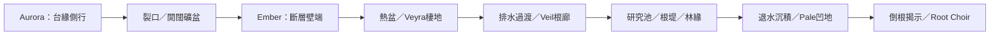

# DeepSpaceRover 更新環境計劃書
**版本：2026-09-28｜狀態：Nova 已接受四視角方向並授權施工｜基準：candidate-r4**

最新授權：概念圖接受後，開始環境、分層圖像邊界及網頁入口／加載美術更新。執行與分工見 `../evidence/environment-entry-20260928T134859Z/BRIEF.md`。下文「只批准規劃／未啟動施工」保留為規劃形成時的歷史狀態，由本段最新授權取代；不重啟舊 deadline，不授權部署。

本計劃回應 Nova 最新要求：先以 ClawTeam 討論環境設計，解決重複地貌、地景單一及近看材質過於規律，再形成可施工的更新方案。本次只產出規劃，不執行新一輪地形／素材修改，也不代表市場驗收通過。

實作根：`C:/Users/tsang/DeepSpaceRover/worktrees/visual-upgrade-20260923`。保留現有 Godot 4.7.2、Compatibility、single-thread Web、完整四區與現有玩法。現行 r4 為可重現比較基準，不能覆寫其凍結來源或證據。

## 1. 設計決策

**目標：讓玩家沿同一條探索路線，經歷四種可以從輪廓、空間及生態關係辨認的外星地景。**

共同語言是礦物與生命相互塑造：岩層提供遮蔭和支撐，裂隙引導水分，植物沿適合的棲地成群，生物表面記錄環境與年齡。電影感由大中小尺度形體、遮擋與揭示、材質受光及接地共同建立。

本輪計劃的三個優先決定：
1. **先重做大形與中景關係。** 每區先定主地貌、空隙、主視線及回望輪廓，再安排植群與近景。
2. **用有原因的變化打破規律。** 朝向、濕度、暴露、沉積、成熟度決定差異；固定種子只負責重現，不代替美術設計。
3. **以完整可駕駛景段交付。** 每個候選同時包含地形、材質、水、光、植被、生物、通行與互動，不逐個零件反覆批准。

## 2. 已確認問題與根因

| 問題 | 現有證據與原因 | 本計劃的處理層 |
|---|---|---|
| 四區側看仍像同一地景 | r4 Aurora／Ember／Pale 側向和回望是大幅平滑坡面及水平條帶。共用高度波形、沿道路距離抬升的側坡與環形山脊形成相近骨架 | 地貌輪廓、剖面、視線及中尺度侵蝕形體 |
| 物件存在但空間關係弱 | 前景道具與遠山間缺少交疊、遮蔽及高低轉折；均勻散佈保留了同一大片空地 | 成因驅動的地貌段、群落、密疏及負空間 |
| 甲殼／皮膚像印製圖樣 | 生物生成器的固定週期層紋、等行列皮膚單元和共用 atlas 反覆出現 | 解剖方向保留，加入生長中斷、局部磨耗、年齡及安靜區 |
| 水仍像低對比暗綠面 | 已有不規則岸邊及反射，但近／側視水、濕泥與床底分離不足 | 真實岸坡、深淺／粗糙度／反射關係與林緣構圖 |
| 加細節可能壓低流暢度 | r4 Standard 平均約56–60FPS，仍未全面達標；Low 約59–60FPS。單一 p95 通過不能隱藏長停頓 | 以可見價值替換成本，保留完整原始區間再量測 |

直接源碼依據：`world.gd::_base_height_at / height_at / _horizon_point`、`living_habitat.gd`、`build_surface_maps.py` 與 `microfauna_visual.gd`。此前淡掉遠景條紋使山坡變成泥模，已被拒絕；不能把同類貼圖強弱調整當成主要解法。

## 3. 四區環境方案

以下尺度是設計起點，不是已施工座標或已驗性能承諾。

| 區域 | 主地貌與輪廓 | 中景／近景關係 | 駕駛節奏與回望 |
|---|---|---|---|
| **Aurora Shelf：破裂風蝕礦台** | 不對稱傾斜台地；一側約15–35m不等高台緣，另一側開放坍塌碎坡，保留天空缺口 | 裂口連接坡腳碎屑；迎風面磨平、背風縫積霜；融水凹處容納低矮附著群 | 沿台緣側行→穿過斷口→看見下一片礦盆；回望仍讀得到同一裂口，避免桌狀石列 |
| **Ember Rift：錯動斷層與熱盆** | 偏斜斷層壁、錯落玄武岩台階和局部開闊熱盆；壁端及脊線互相錯開 | 裂隙交會處才聚煙囪／礦物；岩肋下風側積灰；冷卻陰影區才有植群，保留裸地 | 短暫視覺收束→繞過壁端揭示热源與Veyra棲地→回望讀到壁腳、台面及遠壁 |
| **Veil Marsh：水盆、根堤與林緣** | 不對稱盆地、狹長根堤、局部水槽與不等高膜冠；既有研究池保留為近景核心 | 床底→濕泥→矮草→根群→冠層連成一體；濕岸、乾岸、陰岸各有密疏，保留一段清楚開放水面 | 半遮蔽根廊→靠岸停車／近看→側看根堤→離開林緣回望；不能只以環池一圈植物代表全區 |
| **Pale Decay：坍塌沉積台地** | 淺碟窪地、破裂沉積台緣、倒伏根狀殘體及局部裸坡 | 倒根串連高低坡；殘體接地處形成菌床，外緣薄孢帶，乾坡留空；完整／剝落／裸基底並存 | 沿凹地邊緣行進→倒根形成局部收束→揭示Root Choir；回望看清凹地、殘體和群落關係 |

### 路線概念示意

這是視覺節奏示意，不搬移現有任務點。每區有「收束、揭示、回望」的差異，亦保留真正開闊段，避免把整張地圖變成四條狹窄峽谷。

跨區用成因連接：礦台碎屑進入斷層，熱盆低地排水進入濕地，退水後形成沉積與分解帶。植物、土壤和輪廓逐漸轉換，不在區域線上突然換色。

## 4. 形體、群落與材質的製作規則

### 大中小尺度
- **大形約20–80m：**決定區域輪廓、天空缺口、坡向、台地／凹地與主視線。先在側看和回望成立。
- **中形約3–15m：**斷層端部、崩積扇、根堤、倒根、林緣等，把前景與遠景連接；同一鏡位要有不同深度的遮擋關係。
- **近形約0.2–2m：**接地碎片、濕泥、草簇、小生物與磨耗；不得用它們補救尚未成立的大形。
- 細小法線／粗糙度最後加入；遠處看不到的高頻細節優先刪減。

### 群落分布
只維持少量實用棲地描述：露風面、背風碎屑、濕岸、乾裸地、遮蔭林緣、分解殘體及禁入帶。群落先有邊界和成因，才在其中使用固定種子變化。

每個群落同時設密集核心、疏落外緣與空隙；避免等角環帶、道路兩側等距串列、同一株單純縮放／旋轉。微型生物優先靠接地碎屑與遮蔭濕岸；Aeral 保持飛行，不增加未有的棲息玩法。

### 生物及地表材料
| 類型 | 保留 | 改變 |
|---|---|---|
| 岩層／山坡 | 地質層序、粗糙度與受光 | 層理追隨區域斷層／坡向；加入可讀的斷裂、侵蝕面、積屑和裸露面，避免全域等距水平線 |
| 甲殼 | 甲片生長方向與承重形體 | 層距不均、局部融合／消失、磨平前緣及保存較完整的後緣；不同甲片有少量成熟度差異 |
| 皮膚 | 褶皺／受拉方向與身份色 | 光滑區與有紋區交替，降低均勻魚鱗格子；禁止整身鋪滿同一規律 |
| 膜翼／冠膜 | 真實UV承力方向、既有翼／冠動態 | 主脈／翼根厚薄、非等距分枝、局部退色／磨耗；不靠任意UV旋轉破壞解剖 |
| 水／濕泥 | 唯一反射探針、實際地形交界 | 同時調整岸坡、深淺、反射、濕乾粗糙度及開放水面比例；避免把變亮或染藍等同水感 |

新生、受磨、較老三類可作有限作者樣本，透過共享 atlas／遮罩重用。每個表面要保留可安靜讀形的區域。已有貼圖生成器可改為作者工具，但等距公式本身不能再作主要質感來源。

## 5. 地形／碰撞／存檔的真正邊界

**目前只批准規劃，維持凍結 r4。下一輪不應一邊要求真正改變可行走地貌，一邊假定高度場永遠不能動。**

本計劃建議分兩層：
1. **不可達遠山與非碰撞視覺層：**可先重做輪廓、斷裂與遮露，仍須避開可玩範圍及接縫。
2. **可駕入台階、根堤、槽地：**若需要抬高／切低地面，下一輪需明確把 `height_at`、渲染網格、碰撞、植被接地與 Continue 恢復接地納入同一工作包。這是建議的新施工範圍，**尚未執行或取得額外破壞性授權**。

保護線：
- 保留主要路線、四區連通、活動／物種身份及既有互動規則。
- 以現有10m主廊、6m活動開口作初始保護規則；檢查完整 footprint，不只物件中心。
- 地形、碰撞及放置查詢共用同一份資料，不做假實心斜坡、視覺有地但物理穿過的遮掩。
- 若新地形影響既有離路存檔，設版本與安全接地回復，驗證舊檔 Continue；不能悄悄清空或重設進度。
- 不藉本計劃全面換引擎、新增流體模擬、SSR、多重鏡像 viewport、第二反射探針或通用大型地形框架。

## 6. 下一輪施工次序與完整交付單位

| 階段 | 完整產物 | 進入下一階段的依據 |
|---|---|---|
| M0：空間設計落圖 | 四區俯視配置、关键剖面、進入／側看／回望鏡位、地形權威與存檔影響清單 | 每區有不同輪廓及負空間；保護線明確，選定真正地形修改範圍 |
| M1：首個整合景段 | 以**既有 Veil 研究池—根堤—林緣約40–60m的局部棲地**作主要美術證明；沿現有路線串連Ember→Veil，保留完整四區，另附Morrow近／中距離材料樣本 | 真駕入、近看、側看、倒車回望、E互動均成立；完整材質／光／水／生物已在同一Web候選，不是英雄鏡頭或孤立模型 |
| M2：四區整體擴展 | 將有效空間方法帶到Aurora、Ember、Pale；各自完成大形、中形、群落與過渡 | 四區正／側／回望均有身份與層次；一次完整候選集中覆核 |
| M3：交付驗收 | 凍結同一source／asset／Web版本，完成視覺、旅程、存檔、觸控、性能及獨立審查 | 達到下列標準才進入市場接受決定；未達項不改名為可選項 |

不在本計劃捏造完成所需時數。下一輪以 M0/M1 的實際範圍估時，再設定製作窗口；不自動續開已結束的兩小時。

**尺度核對：**現有Veyra錨點在z約−105至−84，Aeral約−285至−307，研究池z為−342。Veyra至研究池沿z軸已相隔約237–258m，實際駕駛更長。因此討論中的60–100m只可作交界地景段尺度，不能宣稱這麼短的一段能同時包含既有Veyra、Aeral和研究池。整合旅程按原錨點實際量測，不搬動遭遇來湊數。

### 分工
- **world-art：**整體地貌／配置、world與living_habitat、環境材料與水、植群及共享棲地資料；水只設一個owner。
- **creature-art：**主要與微型生物的材料／貼圖／必要UV及周邊棲地接口；保留IK、翼、冠、接觸與反應。
- **root：**場景接口、玩法／保存邊界、shared import/export、GPU時段、Web與性能、整包接受。
- **非作者 verifier：**完整候選後，一次集中問題清單；不逐個器官／資產審批。

每包一次完整 brief→自主建構／自測／修復→整包 handoff。兩次相同方法無改善便改診斷或方法，不換版本名稱重置問題。

## 7. 畫質與功能驗收

1. **四區身份：**移除區名、看灰階輪廓，仍能從地貌及空間辨認四區；不能只憑顏色／道具猜。
2. **側看／回望：**每區保留前／側／後實際Web圖；中景有不同深度與遮擋。大片同樣平滑條帶坡仍支配畫面時不判通過。
3. **真路線：**用鍵盤／觸控真駕駛呈現收束→揭示→近看／互動→回望。固定視角可作檢查，但不當成旅程。
4. **材料：**三物種全身近／中／駕駛距離可讀；同種個體有合理磨耗／成熟度差異。規律線條／網格不能比形體及受光更搶眼。
5. **水岸：**在近看、側看、靜止與行進時分清床底、水面、濕泥；交代反射近似限制，保留不利角度。
6. **嚴格材質A/B：**先設定鏡位，再凍結時間／姿態；讀回相同幾何、光照、矩陣及draw calls。前後環境大改的圖只作整體比較，不冒充純材質A/B。
7. **回歸：**完整四區、E距離／視線、正確轉向、V、煞車／倒車、真失焦暫停、雙語、觸控、save／reload／Continue及接地通過。
8. **性能：**Standard1920×1080 nominal60FPS／p95≤25ms；Low1280×720≥30FPS。每品質每區至少30秒行進／互動，保留所有raw intervals及stalls，與截圖／其他GPU工作分開。目前Standard已未達，不能把p95餘額當新增GPU預算。
9. **市場決定：**独立AI審查是proxy；Nova的實際畫質接受、實體裝置／平台缺口仍需如實處理。計劃、build和測試數量不等於市場完成。

## 8. ClawTeam 討論與 root 收斂

ClawTeam 0.3.0，沿用 `rover-six-hour` 的本地 inbox，討論鍵 `environment-plan-20260928`；原生 Codex world-art／creature-art 任務提供兩個角度。沒有啟動ClawTeam外部模型工人或安裝 orchestration。

- world-art：核心是共用走廊／坡面／環形山脊；先處理地質成因、輪廓、中景遮擋、路線揭示與碰撞權威。
- creature-art：核心是週期式材質與缺乏生境成因；以暴露、水分、沉積、成熟度控制群落和表面。
- root 決定：以Veil完整岸—根堤—林緣為主要證明，納入Ember→Veil過渡；先確立整體空間，生物材料同步驗證，再一次擴至四區。保留舊候選作before，不繼續細調同一套山坡貼圖。

討論原文：
- [世界／空間提案](../evidence/visual-market-extension-20260928T112240Z/environment-plan/world-art.md)
- [生態／材料提案](../evidence/visual-market-extension-20260928T112240Z/environment-plan/creature-art.md)
- [ClawTeam本輪討論原始訊息](../evidence/visual-market-extension-20260928T112240Z/environment-plan/clawteam-discussion.json)
- [獨立視覺問題](../evidence/visual-market-extension-20260928T112240Z/verifier/VISUAL_REVIEW.md)
- [實際前後圖索引](../evidence/visual-market-extension-20260928T112240Z/REVIEW.html)

**本文件完成環境重規劃；沒有依此啟動下一輪施工。**

