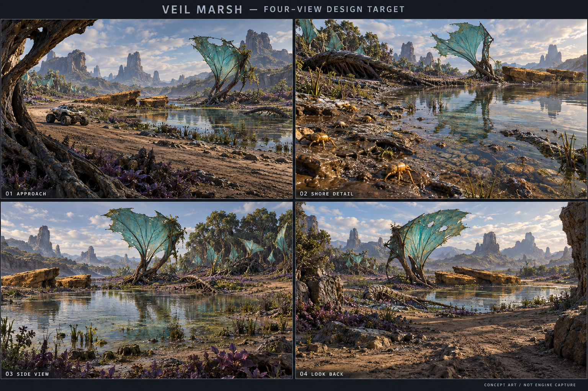

# Veil Marsh 四視角設計目標 v1

本圖回應 Nova「先用 IMAGE 2.5 出四視角、多角度圖鎖定」；使用內建 image_gen 工具。工具沒有模型選擇或模型版本回報，不能宣稱由 IMAGE 2.5 生成。沒有使用 CLI/API fallback。

## 本版提出的視覺鎖定
- 同一 Veil Marsh 岸—根堤—林緣棲地：01 駕駛進入、02 岸邊近看、03 側向層次、04 離開回望。
- 識別地標：青綠撕裂膜冠、兩塊不等大的斷裂赭色礦台、接地倒根。
- 不對稱水盆與開放岸段；床底、淺水、濕泥、低植群、根系及冠層連續過渡。
- 群落有密集核心與空隙；近看材質有沉積、磨耗和安靜區，避免等距規律。
- 以光照、實體形體與前中後景交疊構成層次。

## 核對與限制
已目視確認四格、標籤、概念圖聲明與反覆可辨的地標。生成圖是美術方向參照，並非同一 3D 模型渲染，因此相機、地標距離、光向與遮擋不能視為幾何測量證據。02 的微型生物亦只作質感及尺度參考，不替代既有生物資產。
Nova 已於本對話接受本圖作為美術方向，並授權實作環境、圖像分層邊界及網頁入口／加載美術。這是概念方向接受，不代表遊戲已實作、Web 性能達標或市場版本已完成。新工作見 evidence/environment-entry-20260928T134859Z/BRIEF.md（相對專案根）；舊時間窗口不重啟。
後續以實際 3D layout 核對四鏡位、完整通行與接地，再對照本圖。保留 Godot 4.7.2 Compatibility single-thread Web 約束。

## 來源
- 規劃：[更新環境計劃書](../../ENVIRONMENT_UPDATE_PLAN_2026-09-28.md)
- 實際遊戲身份參考：evidence/visual-market-extension-20260928T112240Z/r4-capture/shore.png（相對專案根）。
- 空間／水岸質感參考：C:/Users/tsang/DeepSpaceRover/deep-space-rover-three-20260906/evidence/visual-upgrade-20260923/nova-valley-reference.png。未用作遊戲材質或複製寺廟等資產。
- 原始輸出：C:/Users/tsang/.codex/generated_images/01a0df51-abe2-7992-b9f4-298c4f4ce902/exec-cc7fcb38-11ff-494a-b7f4-17ec2be938e9.png
- 完整提示詞：[PROMPT.txt](PROMPT.txt)

